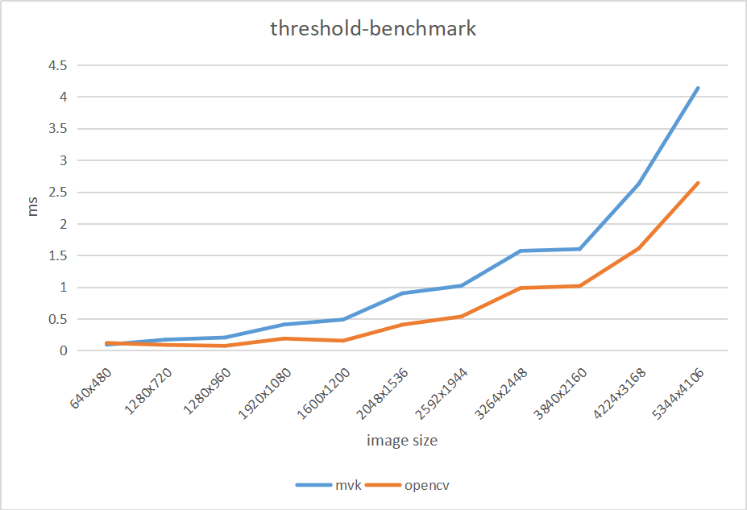

# mango

原项目本意是想做一个为一个面向工业视觉轻量级常用视觉算法库，实现定位、查找与测量等算子功能。现在想法改变了，已经早就不接触工业视觉的内容了，但不意味着完全不做了，有兴趣就会研究和实现。本仓库则转化为一个通用算法的实现，内容是包含我本人日常学习了解的算法，就当做一个学习记录。不仅实现算法，还会做性能优化、包括GPU等的异构优化，而且会实现流水线调度。因此，名字也相应改一下。

项目国内镜像地址[http://git.mangoroom.cn/mango/mvk-nodes](http://git.mangoroom.cn/mango/mvk-nodes)

<details> <summary>介绍</summary>

## 博客记录

1. [有向无环图实现](https://blog.mangoeffect.net/cpp/dag)
2. [算法Graph框架使用介绍](https://blog.mangoeffect.net/cpp/graph-framework-1)

</details>

<details> <summary>性能表现</summary>
## 测试平台：

- Intel(R) Core(TM) i5-4210M CPU @ 2.60GHz
- ubuntu 20.04 lts
- gcc 9.3

## 中值滤波3x3

```
------------opencv mono median-filter3x3 benchmark-------------
640x480 cost 1 ms.
1280x720 cost 2 ms.
1280x960 cost 2 ms.
1920x1080 cost 3 ms.
1600x1200 cost 3 ms.
2048x1536 cost 2 ms.
2592x1944 cost 4 ms.
3264x2448 cost 7 ms.
3840x2160 cost 7 ms.
4224x3168 cost 11 ms.
5344x4106 cost 17 ms.
------------opencv rgb median-filter3x3 benchmark-------------
640x480 cost 1 ms.
1280x720 cost 2 ms.
1280x960 cost 3 ms.
1920x1080 cost 3 ms.
1600x1200 cost 1 ms.
2048x1536 cost 5 ms.
2592x1944 cost 8 ms.
3264x2448 cost 16 ms.
3840x2160 cost 15 ms.
4224x3168 cost 31 ms.
5344x4106 cost 54 ms.

-------------mvk-nodes filter mono median-filter3x3 benchenmark------------------
640x480 cost 0 ms.
1280x720 cost 0 ms.
1280x960 cost 0 ms.
1920x1080 cost 3 ms.
1600x1200 cost 1 ms.
2048x1536 cost 2 ms.
2592x1944 cost 2 ms.
3264x2448 cost 4 ms.
3840x2160 cost 4 ms.
4224x3168 cost 7 ms.
5344x4106 cost 11 ms.
-------------mvk-nodes filter rgb median-filter3x3 benchenmark------------------
640x480 cost 0 ms.
1280x720 cost 3 ms.
1280x960 cost 2 ms.
1920x1080 cost 5 ms.
1600x1200 cost 1 ms.
2048x1536 cost 12 ms.
2592x1944 cost 19 ms.
3264x2448 cost 30 ms.
3840x2160 cost 31 ms.
4224x3168 cost 50 ms.
5344x4106 cost 81 ms.
```


## 阈值化处理

### 二值化

```
-------------mvk-nodes filter threshold benchenmark------------------
640x480 cost 0.0908 ms.
1280x720 cost 0.1711 ms.
1280x960 cost 0.2034 ms.
1920x1080 cost 0.4087 ms.
1600x1200 cost 0.4867 ms.
2048x1536 cost 0.9005 ms.
2592x1944 cost 1.0191 ms.
3264x2448 cost 1.5688 ms.
3840x2160 cost 1.5972 ms.
4224x3168 cost 2.6267 ms.
5344x4106 cost 4.1337 ms.

------------opencv mono median-filter3x3 benchmark-------------
640x480 cost 0.134 ms.
1280x720 cost 0.0793 ms.
1280x960 cost 0.0732 ms.
1920x1080 cost 0.1653 ms.
1600x1200 cost 0.1183 ms.
2048x1536 cost 0.3897 ms.
2592x1944 cost 0.5908 ms.
3264x2448 cost 0.987 ms.
3840x2160 cost 1.0167 ms.
4224x3168 cost 1.6279 ms.
5344x4106 cost 2.7114 ms.
```


注：opencv版本为4.5.4

</details>

<details> <summary>路线图（待重新规划）</summary>

| 算法模块 | 状态 | 介绍 |
| --- | --- | ---- |
| [blob analysis[斑点分析]](https://github.com/mangosroom/machine-vision-algorithms-library/tree/master/src/blobdetect) | complete | [博客连接](https://mangoroom.cn/opencv/better-blob-detection-based-on-simepleblobdetector.html) |
| [caliper tool[卡尺工具]](https://github.com/mangosroom/machine-vision-algorithms-library/tree/master/src/caliper) | complete | - |
| [line fit[直线拟合]](https://github.com/mangosroom/machine-vision-algorithms-library/tree/master/src/linefit) | - | [博客链接](https://mangoroom.cn/opencv/mean-absolute-error-line-fit.html) |
| line search | - | - |
| circle fit | - | [博客链接](https://mangoroom.cn/opencv/mean-absolute-error-circle-fit.html) |
| circle search | - | - |
| template matching | - | - |
| N points calibration | - | - |
| distortion calibration | - | - |
| calib board calibration | - | - |
| calibration transfer | - | - |
| image filtering | box-filter、gaussion-filter、median-filter、threshold | - |
| location fix | - | - |
| camera map | - | - |
| Barcode reader | - | - |
| QR code reader | - | - |
| OCR | - | - |
| Preprocessing | - | - |

</details>


**License**

[ Apache-2.0 License](https://github.com/mangosroom/machine-vision-algorithms-library/blob/master/LICENSE)
