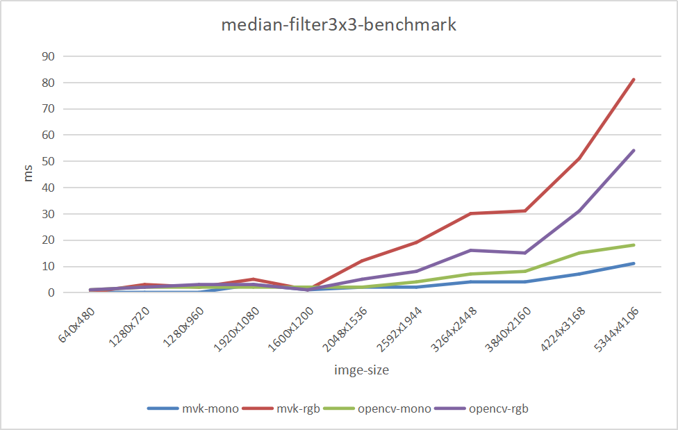

# mvk-nodes

本项目为一个面向工业视觉轻量级常用视觉算法库，实现定位、查找与测量等算子功能。项目国内镜像地址[http://git.mangoroom.cn/mango/mvk-nodes](http://git.mangoroom.cn/mango/mvk-nodes)

# 性能表现

## 测试平台：

- Intel(R) Core(TM) i5-4210M CPU @ 2.60GHz
- ubuntu 20.04 lts
- gcc 9.3

## 中值滤波性3x3

```
------------opencv mono median-filter3x3 benchmark-------------
640x480 cost 1 ms.
1280x720 cost 2 ms.
1280x960 cost 2 ms.
1920x1080 cost 3 ms.
1600x1200 cost 3 ms.
2048x1536 cost 2 ms.
2592x1944 cost 4 ms.
3264x2448 cost 7 ms.
3840x2160 cost 7 ms.
4224x3168 cost 11 ms.
5344x4106 cost 17 ms.
------------opencv rgb median-filter3x3 benchmark-------------
640x480 cost 1 ms.
1280x720 cost 2 ms.
1280x960 cost 3 ms.
1920x1080 cost 3 ms.
1600x1200 cost 1 ms.
2048x1536 cost 5 ms.
2592x1944 cost 8 ms.
3264x2448 cost 16 ms.
3840x2160 cost 15 ms.
4224x3168 cost 31 ms.
5344x4106 cost 54 ms.

-------------mvk-nodes filter mono median-filter3x3 benchenmark------------------
640x480 cost 0 ms.
1280x720 cost 0 ms.
1280x960 cost 0 ms.
1920x1080 cost 3 ms.
1600x1200 cost 1 ms.
2048x1536 cost 2 ms.
2592x1944 cost 2 ms.
3264x2448 cost 4 ms.
3840x2160 cost 4 ms.
4224x3168 cost 7 ms.
5344x4106 cost 11 ms.
-------------mvk-nodes filter rgb median-filter3x3 benchenmark------------------
640x480 cost 0 ms.
1280x720 cost 3 ms.
1280x960 cost 2 ms.
1920x1080 cost 5 ms.
1600x1200 cost 1 ms.
2048x1536 cost 12 ms.
2592x1944 cost 19 ms.
3264x2448 cost 30 ms.
3840x2160 cost 31 ms.
4224x3168 cost 50 ms.
5344x4106 cost 81 ms.
```



注：opencv版本为4.5.4

# 路线图

| 算法模块 | 状态 | 介绍 |
| --- | --- | ---- |
| [blob analysis[斑点分析]](https://github.com/mangosroom/machine-vision-algorithms-library/tree/master/src/blobdetect) | complete | [博客连接](https://mangoroom.cn/opencv/better-blob-detection-based-on-simepleblobdetector.html) |
| [caliper tool[卡尺工具]](https://github.com/mangosroom/machine-vision-algorithms-library/tree/master/src/caliper) | complete | - |
| [line fit[直线拟合]](https://github.com/mangosroom/machine-vision-algorithms-library/tree/master/src/linefit) | - | [博客链接](https://mangoroom.cn/opencv/mean-absolute-error-line-fit.html) |
| line search | - | - |
| circle fit | - | [博客链接](https://mangoroom.cn/opencv/mean-absolute-error-circle-fit.html) |
| circle search | - | - |
| template matching | - | - |
| N points calibration | - | - |
| distortion calibration | - | - |
| calib board calibration | - | - |
| calibration transfer | - | - |
| image filtering | box-filter、gaussion-filter、median-filter | - |
| location fix | - | - |
| camera map | - | - |
| Barcode reader | - | - |
| QR code reader | - | - |
| ocr | - | - |
| Preprocessing | - | - |

**License**

[ Apache-2.0 License](https://github.com/mangosroom/machine-vision-algorithms-library/blob/master/LICENSE)
