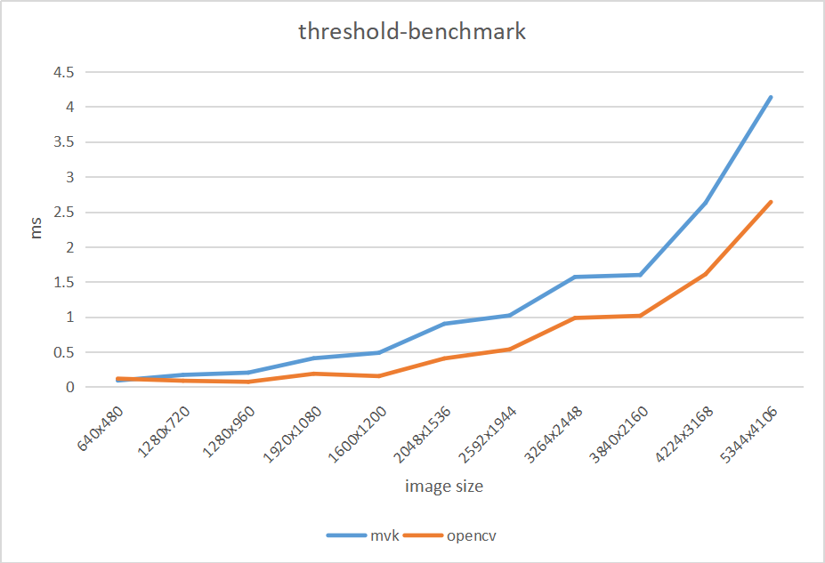

# 性能表现

## 测试平台：

- Intel(R) Core(TM) i5-4210M CPU @ 2.60GHz
- ubuntu 20.04 lts
- gcc 9.3

## 中值滤波3x3

```
------------opencv mono median-filter3x3 benchmark-------------
640x480 cost 1 ms.
1280x720 cost 2 ms.
1280x960 cost 2 ms.
1920x1080 cost 3 ms.
1600x1200 cost 3 ms.
2048x1536 cost 2 ms.
2592x1944 cost 4 ms.
3264x2448 cost 7 ms.
3840x2160 cost 7 ms.
4224x3168 cost 11 ms.
5344x4106 cost 17 ms.
------------opencv rgb median-filter3x3 benchmark-------------
640x480 cost 1 ms.
1280x720 cost 2 ms.
1280x960 cost 3 ms.
1920x1080 cost 3 ms.
1600x1200 cost 1 ms.
2048x1536 cost 5 ms.
2592x1944 cost 8 ms.
3264x2448 cost 16 ms.
3840x2160 cost 15 ms.
4224x3168 cost 31 ms.
5344x4106 cost 54 ms.

-------------mvk-nodes filter mono median-filter3x3 benchenmark------------------
640x480 cost 0 ms.
1280x720 cost 0 ms.
1280x960 cost 0 ms.
1920x1080 cost 3 ms.
1600x1200 cost 1 ms.
2048x1536 cost 2 ms.
2592x1944 cost 2 ms.
3264x2448 cost 4 ms.
3840x2160 cost 4 ms.
4224x3168 cost 7 ms.
5344x4106 cost 11 ms.
-------------mvk-nodes filter rgb median-filter3x3 benchenmark------------------
640x480 cost 0 ms.
1280x720 cost 3 ms.
1280x960 cost 2 ms.
1920x1080 cost 5 ms.
1600x1200 cost 1 ms.
2048x1536 cost 12 ms.
2592x1944 cost 19 ms.
3264x2448 cost 30 ms.
3840x2160 cost 31 ms.
4224x3168 cost 50 ms.
5344x4106 cost 81 ms.
```


## 阈值化处理

### 二值化

```
-------------mvk-nodes filter threshold benchenmark------------------
640x480 cost 0.0908 ms.
1280x720 cost 0.1711 ms.
1280x960 cost 0.2034 ms.
1920x1080 cost 0.4087 ms.
1600x1200 cost 0.4867 ms.
2048x1536 cost 0.9005 ms.
2592x1944 cost 1.0191 ms.
3264x2448 cost 1.5688 ms.
3840x2160 cost 1.5972 ms.
4224x3168 cost 2.6267 ms.
5344x4106 cost 4.1337 ms.

------------opencv mono median-filter3x3 benchmark-------------
640x480 cost 0.134 ms.
1280x720 cost 0.0793 ms.
1280x960 cost 0.0732 ms.
1920x1080 cost 0.1653 ms.
1600x1200 cost 0.1183 ms.
2048x1536 cost 0.3897 ms.
2592x1944 cost 0.5908 ms.
3264x2448 cost 0.987 ms.
3840x2160 cost 1.0167 ms.
4224x3168 cost 1.6279 ms.
5344x4106 cost 2.7114 ms.
```


注：opencv版本为4.5.4